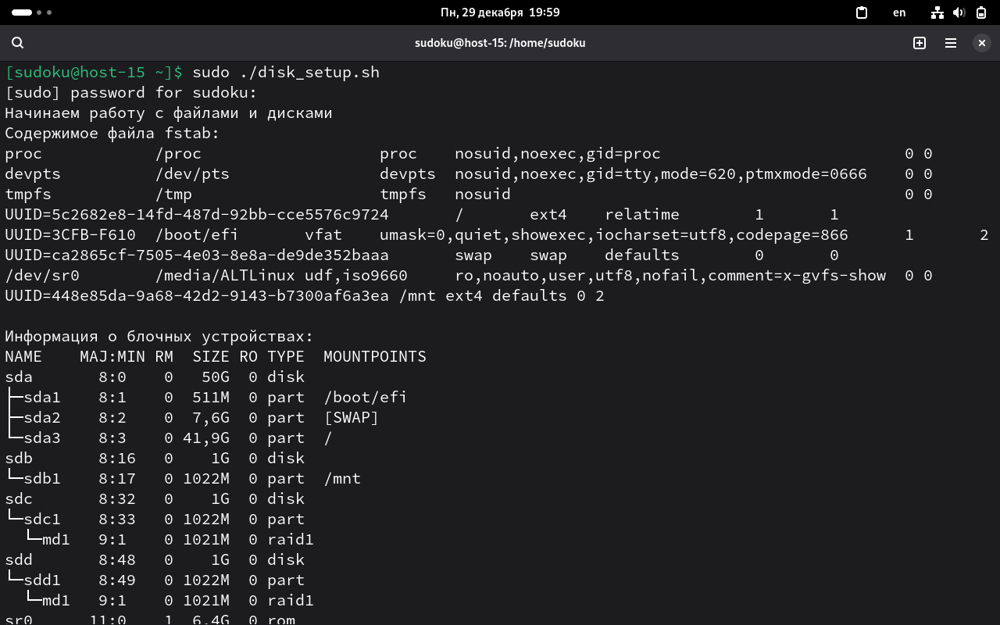
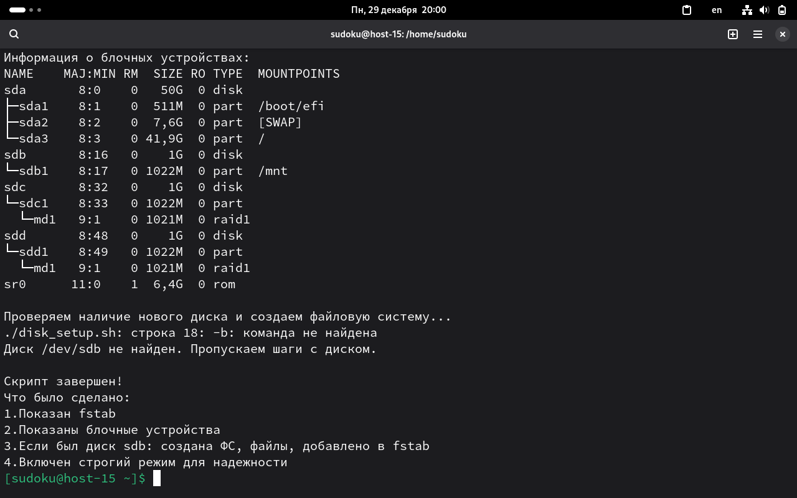

Пункт 1:
Шебанг - это первая строка в скрипте, которая начинается с #! и указывает системе каким интерпретатором выполнять скрипт

Пункт 2:
нет, так как важны права на выполнение, шебанг, содержимое

Пункт 3:

#!/bin/bash
set -euo pipefail

echo "Начинаем работу с файлами и дисками "

echo "Содержимое файла fstab:"
cat /etc/fstab

echo ""

echo "Информация о блочных устройствах:"
lsblk

echo ""

echo "Проверяем наличие нового диска и создаем файловую систему..."

if  -b /dev/sdb ; then
    echo "Найден диск /dev/sdb"
    
    echo "Создаем раздел на /dev/sdb..."
    echo -e "g\nn\n\n\n\n\nw" | sudo fdisk /dev/sdb
    
    echo "Создаем файловую систему ext4..."
    sudo mkfs.ext4 /dev/sdb1
    
    echo "Создаем точку монтирования /mnt/mydisk..."
    sudo mkdir -p /mnt/mydisk
    
    echo "Монтируем диск..."
    sudo mount /dev/sdb1 /mnt/mydisk
    
    echo "Работа с файлами в /mnt/mydisk..."
    
    cd /mnt/mydisk
    
    echo "Создаем тестовые файлы..."
    sudo touch file1.txt file2.txt file3.txt
    sudo mkdir my_folder
    
    echo "Это тестовый файл 1" | sudo tee file1.txt
    echo "Это тестовый файл 2" | sudo tee file2.txt  
    echo "Это тестовый файл 3" | sudo tee file3.txt
    
    echo "Содержимое каталога /mnt/mydisk:"
    ls -la
    
    echo "Отмонтируем диск..."
    cd ~
    sudo umount /mnt/mydisk
    
    echo "Проверяем что в /mnt/mydisk пусто после отмонтирования:"
    ls -la /mnt/mydisk/ || echo "Каталог пуст или недоступен"
    
    echo "Добавляем запись в fstab..."
    
    UUID=$(sudo blkid /dev/sdb1 -s UUID -o value)
    echo "UUID диска: $UUID"
    
    if ! grep -q "$UUID" /etc/fstab; then
        echo "Добавляем запись в fstab..."
        echo "UUID=$UUID /mnt/mydisk ext4 defaults 0 2" | sudo tee -a /etc/fstab
    else
        echo "Запись для этого диска уже есть в fstab"
    fi
    
    echo "Проверяем корректность fstab..."
    sudo mount -a
    echo "Проверка прошла успешно!"
    
    echo "Монтируем диск обратно для проверки..."
    sudo mount /dev/sdb1 /mnt/mydisk
    
    echo "Проверяем что файлы сохранились:"
    ls -la /mnt/mydisk/
    
    echo "Отмонтируем диск для чистоты..."
    sudo umount /mnt/mydisk
    
else
    echo "Диск /dev/sdb не найден. Пропускаем шаги с диском."
fi

echo ""
echo "Скрипт завершен! "
echo "Что было сделано:"
echo "1.Показан fstab"
echo "2.Показаны блочные устройства" 
echo "3.Если был диск sdb: создана ФС, файлы, добавлено в fstab"
echo "4.Включен строгий режим для надежности"

объяснение что делают эти флаги:
set -e  - остановить скрипт сразу если любая команда завершится с ошибкой
set -u  - остановить скрипт если используется необъявленная переменная  
set -o pipefail - считать скрипт неудачным если ошибка в любой команде pipefile

