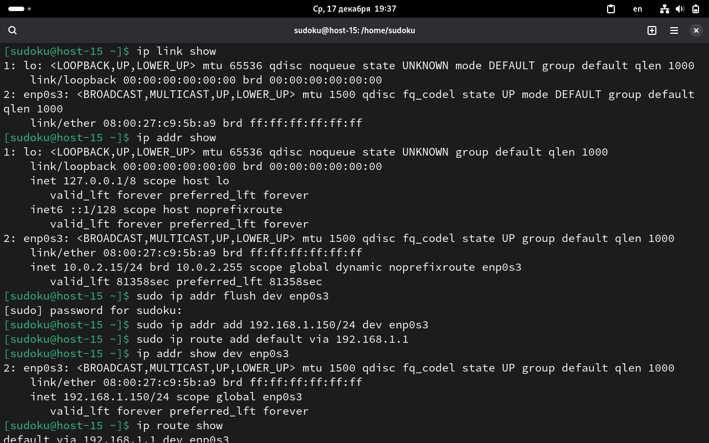
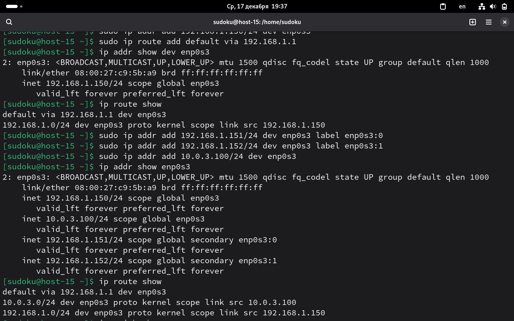
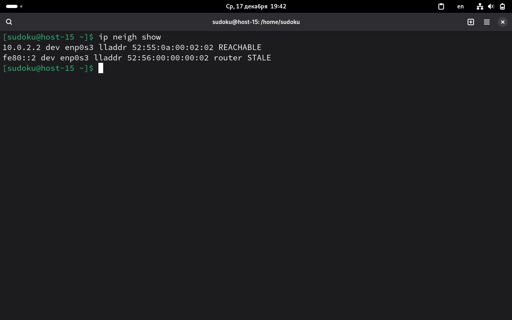

скрины в скрины/Network

1. Выведите список интерфейсов, какими способами можно это сделать?
ip link show
    
2. Попробуйте изменить ip адрес
смотрим текущую конфигурацию
ip addr show

временно изменим айпи
sudo ip addr flush dev enp0s3
sudo addr add 192.168.1.150/24 dev enp0s3

добавим шлюз по умолчанию
sudo ip route add default via 192.168.1.1

проверка
ip addr show enp0s3
ip route show
    
3. Попробуте добавить несколько ip адресов на сетевую карту

sudo ip addr add 192.168.1.151/24 dev enp0s3 label enp0s3:0
sudo ip addr add 192.168.1.152/24 dev enp0s3 label enp0s3:1
sudo ip addr add 10.0.3.100/24 dev enp0s3

проверка
ip addr show enp0s3

4. Выведите список маршрутов
ip route show

5. Выведите arp таблицу
ip neigh show

6. Что такое ip адрес?
IP-адрес - уникальный идентификатор устройства в сети
7. Для чего нужны маршруты?
    
8. Что за протокол arp?
ARP - это протокол канального уровня в сетях TPC/IP, который связывает IP-адрес с MAC-адресом устройства в локальной сети
    
9. Что такое dhcp?
DHCP автоматически назначает IP-адреса устройствам в сети
    
10. Что такое dns?
система преобразования доменных имен в IP-адреса, понятные компьютерам
    
11. Как называется один из протоколов синхронизации времени?
Самый распространенный и важный - NTP. Он используется для синхронизации системных часов компьютеров и сетевого оборудования с точными эталонными часами через интернет или локальную сеть. Есть еще SNTP(упрощенная версия NTP), PTP(для экстремально высокой точности), TOD(для передачи по последовательным интерфейсам).
    
12. Что такое широковещательный запрос, зачем он нужен?
Широковещательный запрос(Broadcast) - отправка пакета данных всем устройствам в пределах одной локальной сети. Устройство-отправитель напрвляет пакет на широковещательный адрес, и все устройства в сегменте сети обязаны его принять и обработать. 
Нужен для обнаружения устройств, запросов конфигураций и маршрутизации.
    
13. Какой адресс является широковещательным?
На канальном уровне: FF:FF:FF:FF:FF:FF
На сетевом уровне: 
    255:255:255:255 для локальной подсети
    направленный: у нас есть сеть 192.168.1.0/24, для нее широковещательный - 192.168.2.255
    
14. Какие ещё параметры можно задать сетевой карте?
Можно задать: шлюз по умолчанию, DNS-серверы, альтернативную конфигурацию IP, скорость, аппаратный MAC-адрес, MTU
    
15. Что такое маска подсети? зачем она нужна?
Маска подсети - битовая маска(последовательность из единиц и нулей), которая определяет, какая часть IP-адреса относится к адресу сети, а какая к адресу конкретного устройства в этой сети.
Она нужна для определения принадлежности к сети, разделения сетей, эффективного использования адресного пространства и маршрутизации.