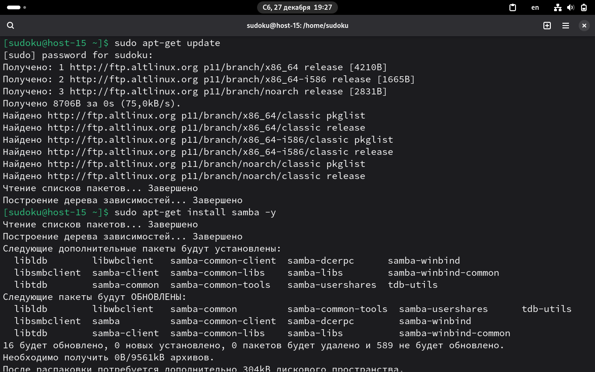
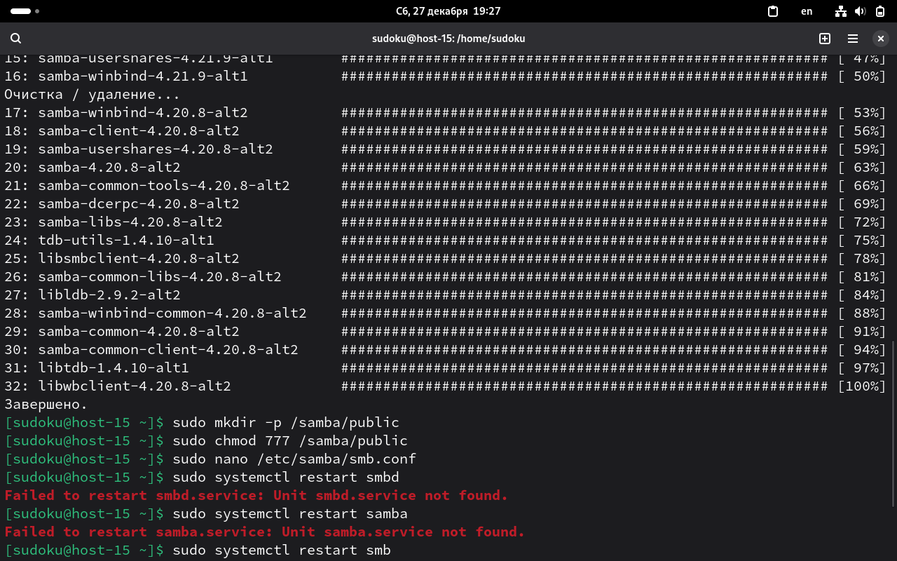
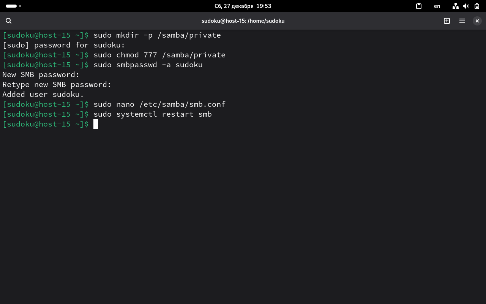
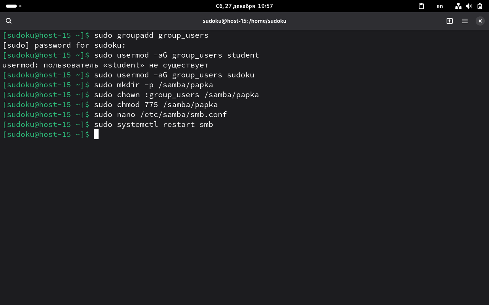
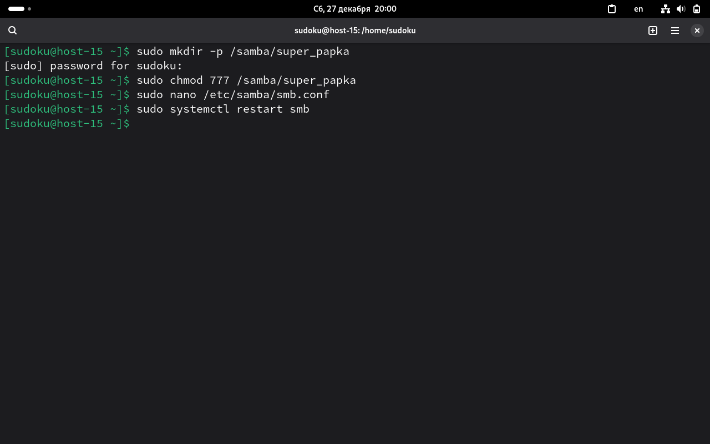

Пункт 1:
sudo apt-get update && sudo apt-get install samba -y
systemctl status smbd

Пункт 2:
доступ к общей папке открыт в локальной сети для ее пользователей
нужна для удобства обмена файлами между компьютерами

Пункт 3:
sudo mkdir -p /samba/public
sudo chmod 777 /samba/public

в файл sudo nano /etc/samba/smb.conf добавляем:
[public_share]
path = /samba/public
guest ok = yes
read only = yes

сохраняем и перезапускаем
sudo systemctl restart smbd

Пункт 4:
sudo mkdir -p /samba/private
sudo chmod 777 /samba/private
sudo smbpasswd -a pswrd

в /etc/samba/smb.conf добавляем
[private_share]
path = /samba/private
valid users = student
read only = no

сохраняем и перезапускаем
sudo systemctl restart smbd

Пункт 5:
sudo groupadd group_users
sudo usermod -aG group_users sudoku

sudo mkdir -p /samba/papka
sudo chown :group_users /samba/papka
sudo chmod 775 /samba/papka

в /etc/samba/smb.conf добавляем
[papka]
path = /samba/papka
valid users = @group_users
read only = no

Пункт 6:
polni_dostup - полный доступ
only_chtenie - только чтение
dostupa_net - нет доступа

sudo mkdir -p /samba/super_papka
sudo chmod 777 /samba/super_papka

/etc/samba/smb.conf
[super_papka]
path = /samba/super_papka
valid users = @polni_dostup, @only_chtenie
write list = @polni_dostup
read only = yes

сохраняем и перезапускаем
sudo systemctl restart smbd

